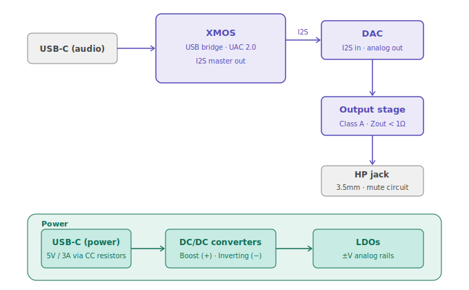

# USB-C / Bluetooth DAC + Headphone Amp

A from-scratch desktop headphone DAC and amplifier with USB-C audio input, Bluetooth audio, and USB-C power. Designed as a personal project to go end-to-end on PCB layout for analog audio including power architecture, analog signal chain, grounding strategy, all of it.

> **Status:** Firmware and circuit protoboarding in progress. Schematic on hold until protoboard validation is complete. PCB layout not yet started.

---

<!-- Block diagram -->

*Top-level block diagram — XMOS handles USB bridging and input selection; I2S to DAC; split rail power from 5V USB-C*

---

## Why this exists

There are plenty of cheap USB dongles that measure fine. They don't teach you anything about why a particular output stage topology works, how to keep a switching converter's noise out of a 192 kHz signal path, or what it actually takes to drive a high-impedance headphone cleanly from a 5V supply.

So I built one.

---

## Design target: Beyerdynamic T90

The primary design target is the Beyerdynamic T90 — 250Ω nominal impedance, 102 dB SPL/mW sensitivity. It's on the harder end of common headphone loads and sets the binding constraints for the output stage and power architecture. The design is intended to work well with other headphones too, from low-impedance IEMs up through other high-impedance dynamics.

---

## Specs (targets)

| Parameter | Target | Notes |
|---|---|---|
| Audio inputs | USB-C (UAC 2.0) | Bluetooth planned for future revision |
| Power input | USB-C, 5V/3A (15W) via CC resistors | No PD controller; resistor-configured only |
| Sample rate | Up to 192 kHz / 24-bit via USB | |
| Output | 3.5mm stereo headphone jack | |
| Output power | 200 mW into 250Ω, 50 mW into 32Ω | T90 rated max is 200 mW |
| Output impedance | < 1Ω | Covers T90 and low-Z IEMs without FR interaction |
| SNR | > 110 dB | T90 resolves enough detail to hear the difference |
| THD+N | < 0.005% | |
| Supply rails | ±[V] regulated | Boost + inverting DC/DC, post-LDO on each rail |
| Layers | 4-layer PCB | |

---

## System architecture

The design splits into three concerns: power, digital audio routing, and the analog output stage.

**USB audio path:** USB-C receptacle → XMOS → I2S → DAC

**Power path:** USB-C (5V/3A via CC resistors) → boost converter (+rail) + inverting converter (−rail) → LDO per rail → analog supply

The XMOS processor is the hub of the digital audio section. It handles USB device enumeration and UAC 2.0 audio streaming from the USB-C input, then passes I2S to the DAC. The XMOS was chosen over a dedicated USB audio bridge IC because it consolidates bridging and any future audio routing logic into firmware rather than fixed hardware making Bluetooth and EQ mode selection practical additions in a future revision without a board respin of the core architecture.

The power path is driven by the 5V USB-C input constraint. Two DC/DC converters step the 5V bus up to split rails, each followed by a dedicated LDO for noise rejection before anything analog sees the supply. Power sequencing on split rails requires a muting circuit to hold the headphone output disconnected until both rails are stable.

---

## Repository layout

```
usb-audio-dac-amp/
├── hardware/
│   ├── schematic/       # KiCad schematic source (in progress)
│   ├── pcb/             # KiCad PCB layout (not started)
│   ├── fab/             # Gerbers, drill files, production BOM
│   ├── lib/             # Custom symbols and footprints
│   └── datasheets/      # Key IC datasheets
├── firmware/
│   ├── src/             # XMOS firmware (USB audio, input selection, I2S routing)
│   └── README.md        # Toolchain and flash instructions
├── docs/
│   ├── block-diagram.png
│   ├── design-notes.md  # Running log of decisions and trade-offs
│   └── images/          # Board photos, scope captures, renders
├── testing/
│   ├── test-plan.md
│   └── results/         # Measurements, audio analyzer output
└── README.md
```

---

## Design decisions (short version)

Longer rationale for each of these is in `docs/design-notes.md`.

**XMOS processor:** Handles USB device enumeration (UAC 2.0) and I2S output to the DAC. Chosen over a fixed-function USB bridge IC because the programmable architecture makes future additions (Bluetooth input, EQ processing, display control) firmware work rather than hardware changes.  

**DAC IC:** [TBD] — key constraints are I2S compatibility with the XMOS output, package suitable for hand-soldering on a first rev, and noise floor.

**Output stage:** Class A topology. Must drive 250Ω with < 1Ω output impedance and sufficient voltage swing for 200 mW into the T90, while remaining stable into low-impedance loads.

**Power architecture:** 5V from USB-C via CC resistors (no PD controller). Boost converter for the positive rail, inverting converter for the negative, both from the 5V bus. One dedicated LDO per rail for noise rejection. Analog and digital ground returns joined at a single point near the DAC.

---

## Build status / revision history

| Rev | Status | Notes |
|---|---|---|
| v0.1 | In progress | Firmware development and protoboard circuit validation underway. Schematic on hold pending results. |

---

## Measurements

*To be populated after first board bring-up.*

Planned: output noise floor, THD+N vs. frequency, crosstalk (L/R), frequency response 20 Hz–20 kHz, PSRR on the analog rail, output impedance.

---

## Full writeup

A detailed post covering the whole design process  will be published here when the project is complete: [link TBD]

---

## Tools used

- KiCad for schematic and PCB
- [Audio analyzer, e.g. REW / ARTA] for measurements
- LTSpice for simulation
- Octave GNU for future EQ filter testing

---

## License

Hardware: [CERN OHL v2 Permissive](LICENSE)
Firmware: MIT
